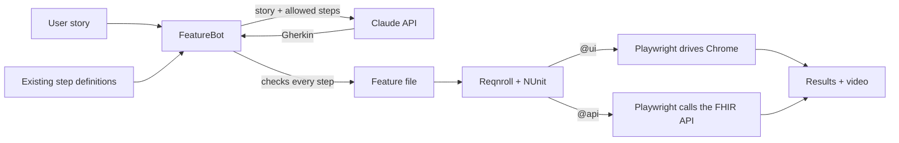

# OpenMRS – AI-Powered Healthcare Test Automation

End-to-end UI and FHIR API tests for [OpenMRS 3](https://openmrs.org), an open-source electronic medical record system used by clinics worldwide. An AI bot turns user stories into runnable BDD feature files.

**Stack:** C# / .NET 8 · Playwright for .NET (UI **and** API) · Reqnroll (successor to SpecFlow) · NUnit · HL7 FHIR R4 · Claude API

> Uses synthetic demo data only. Never run these tests against a system containing real patient data.

##Evidences
 [Sample test run report](https://lisnathomas.github.io/openmrs-ai-test-automation/sample-run/report.html): every scenario with its video, trace and API evidence
    - [Test videos](docs/sample-run/videos) · [API evidence](docs/sample-run/api-evidence)

---

## What's covered

| Story | Type | Scenarios |
| --- | --- | --- |
| US-001 Clinician logs in to OpenMRS | UI (Playwright browser) | Login with clinic location, wrong password, unknown user |
| US-002 FHIR Patient API returns correct patient data | API (FHIR R4) | Capability statement, patient search, read by id, search by family name, 404 for unknown id, 401 without or with wrong credentials |

---

## How it works



1. **The story** is written the way a BA would write it, with acceptance criteria and a `Tags:` line (`@ui` or `@api`).
2. **FeatureBot** reads the story and every `[Given]`/`[When]`/`[Then]` phrase in `StepDefinitions`, and asks Claude to write a feature file using **only** those phrases.
3. **The bot checks the result**, including that each step uses the right keyword. If a step has no code yet, it lists it and stops, so nothing half-broken reaches the test run.
4. **Reqnroll** turns the feature file into NUnit tests. `@ui` scenarios run in Chrome; `@api` scenarios call the FHIR API directly.
5. **Every UI scenario is recorded as a video**; failures also get a full-page screenshot.

---

## Setup

### 1. Run OpenMRS locally

You need **Docker Desktop** (with the WSL 2 backend on Windows) and **Git**. OpenMRS is large, so give Docker plenty of memory.

In PowerShell:

```powershell
git clone https://github.com/openmrs/openmrs-distro-referenceapplication.git
cd openmrs-distro-referenceapplication
docker compose -f docker-compose.yml up -d
```

The **first start is slow** (often 15–30 minutes) while OpenMRS builds its database. Watch progress with `docker compose -f docker-compose.yml logs -f backend`.

When it's ready, open http://localhost/openmrs/spa, log in as `admin` / `Admin123`, and choose **Outpatient Clinic**. Search for a patient to confirm demo patients exist; if there are none, register one.

- Stop OpenMRS: `docker compose -f docker-compose.yml down` (your data is kept).
- Start it again later: `docker compose -f docker-compose.yml up -d` (much faster after the first time).
- **Port 80 already in use?** In `docker-compose.yml`, change the gateway's `"80:80"` to `"8081:80"`, restart, and set `baseUrl` to `http://localhost:8081/openmrs` in `OpenMrs.Tests/testsettings.json`.

### 2. Run the tests in Visual Studio

1. Open `OpenMrs.AiTests.sln` and choose **Build > Build Solution**.
2. Open **Test > Test Explorer** and click **Run All**. The first run downloads Chrome.
3. You should see **10 tests pass**: 3 UI and 7 API.

**How the tests run** is controlled by `OpenMrs.Tests/testsettings.json` (open it from Solution Explorer, edit, save, run again):

| Setting | Demo value | Meaning |
| --- | --- | --- |
| `headed` | `true` | Show Chrome while the UI tests run. Set `false` for fast, invisible runs. |
| `slowMoMs` | `600` | Pause after every browser action so people can follow along. Set `0` for full speed. |
| `pauseAtEndMs` | `2000` | Keep the final screen (with the PASSED/FAILED banner) visible at the end of each video. |
| `stepCaptions` | `true` | Show the current Gherkin step as a caption at the bottom of the page and the video. |
| `recordTrace` | `true` | Save a Playwright trace for step-by-step replay. |
| `baseUrl`, `username`, `password` | | Where OpenMRS runs and the demo login. |

An environment variable with the same meaning (`HEADED`, `SLOWMO`, `OPENMRS_BASE_URL`...) overrides the file, which is how CI runs headless.

### Evidence from every run

Each run gets its own folder, so nothing is overwritten: `OpenMrs.Tests\bin\Debug\net8.0\artifacts\run-<date-time>\`

| What | Where | For |
| --- | --- | --- |
| **report.html** | run folder | One page with every scenario: PASSED/FAILED, duration, video, trace, API calls. Open it in your browser. |
| Videos | `videos\` | UI scenarios, with step captions, a pink outline around every checked element, and a PASSED/FAILED banner at the end. |
| Traces | `traces\` | Step-by-step replay: open [trace.playwright.dev](https://trace.playwright.dev) and drop in the `.zip`. It runs in your browser and isn't uploaded. |
| API evidence | `api-evidence\` | One JSON file per API call: the request (password masked) and the full response, including FHIR resources. |
| Screenshots | `screenshots\` | Full-page screenshot when a UI scenario fails. |


